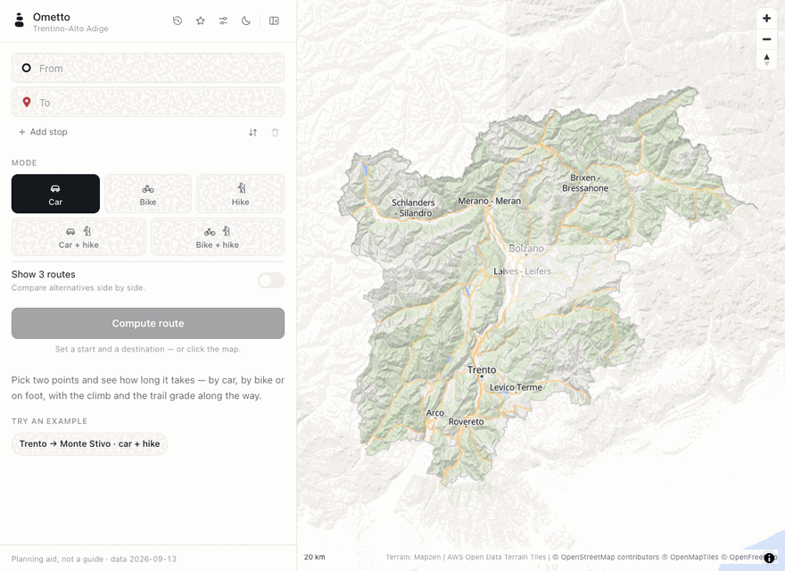

# Ometto

A route planner for **Trentino-Alto Adige**, live at **[omettomaps.com](https://omettomaps.com)**.



The region's roads, paths, cycleways and lifts are held in memory — 443k junctions, 545k
stretches, every one of them with an elevation — and searched for five kinds of trip: car,
bike, hike, car+hike and bike+hike. Trails carry the SAT grades **T / E / EE / EEA**, with an
opt-in **Alpine** grade above them for ground no signpost describes. A route answers with its
time, its climb, an elevation profile, turn-by-turn steps in the vocabulary of the mode you
are in, and the grade of the hardest thing it makes you walk. Climbing crags are on the map and in
the search too, as far as OpenStreetMap has them, so the walk in to one is a car+hike plan like any
other.

**[Queen](https://queenmq.com) sits between the click and the search.** Every request is
pushed to the `routes` queue and answered on the `answers` queue; the broker's KV holds each
browser's favourites and history. When the broker cannot be reached the same engine answers in
the web process and the answer says so, because the queue is how an answer travels, not
whether there is one.

## Run it

The map is not in this repository: it is derived from an OpenStreetMap extract, a
Copernicus DEM and the SAT trail cadastre, and it weighs 549 MB. A fresh clone builds it
once, in about four minutes (see [the map](#the-map) below), and after that it is on disk:

```sh
tools/refresh-region.sh  # the region map, the layers and the basemap, from the sources
make broker-up           # Queen on :6633 and its Postgres on :5471, in Docker
make router router-run   # build bin/router, restart it on :8100, print /api/health
```

The page and the API are then on **http://localhost:8100**. For frontend work there is a Vite
dev server on :5173 (`cd web/app && npm run dev`) that proxies `/api` and `/map` to :8100;
what the router serves is the built bundle in `web/app/dist`, rebuilt with `make web`. That
target builds aside and swaps, which a plain `vite build` does not: it empties `dist` while
:8100 is serving out of it.

```sh
make test                # the engine's and the service's unit tests
make routes              # the 15 published reference routes against :8100
```

Restart the router after a code change, a new map or a new POI file — not after a frontend
build, because `web/app/dist` is read per request. It is up in about two seconds and holds
~1.1 GB.

## The API, in one line each

Everything is JSON and every coordinate on the wire is WGS84 lat/lon. The handlers are in
`cmd/router/server.go`; the shapes they answer with are the Go types in `internal/route`.

| endpoint | what it does |
|---|---|
| `POST /api/route` | the product: 2-6 stops plus any number of vias, a mode, a grade, `alternatives` 1 or 3, an optional avoid list. Answers routes, or `routes: []` with a `reason` (and `neededGrade` when a harder grade would work) |
| `GET /api/geocode?q=` | places, peaks, huts, passes, streets and trail numbers, case- and accent-insensitive |
| `GET /api/reverse?lat=&lon=&mode=` | what the nearest routable junction is called, in that mode's vocabulary |
| `GET /api/config` | what the page needs at run time: styles, terrain, data dates, attribution |
| `GET /api/health` | `ok`, the graph's size, the queue's state, whether it is degraded |
| `GET /api/favorites`, `/api/history` | per browser id, in the broker's KV; **503** with a reason while the broker is unreachable, never an empty list |
| `GET /api/layers/{name}` | the GeoJSON the page draws over the basemap |
| `GET /map/…` | the self-hosted basemap: vector tiles out of a PMTiles archive, styles, glyphs, sprites |
| `GET /metrics` | Prometheus text; refused to anything arriving through the tunnel |


## What is where

```
cmd/router/        the service: HTTP, the Queen request/reply, favourites and history in KV
internal/route/    the engine: the map reader, the CSR graph per mode, A*, the geocoder
internal/city/     the geometry types the engine is built on (city.go, paths.go)
internal/queenx/   the thin wrapper over the Queen Go SDK
third_party/       the vendored Queen Go SDK the module replaces to
web/app/           the page: Vue 3, Tailwind 4, MapLibre; built into web/app/dist
web/public/        the region map (taa.json) and the GeoJSON layers the page draws
web/tiles/         the self-hosted basemap: taa.pmtiles, styles, glyphs, sprites, relief
data/osm-taa/      the OSM extracts the pipeline produced, and the geocoder's places and POIs
tools/             the map pipeline: OSM extract to taa.json, the SAT join, the basemap
tests/             the reference routes and the harness that scores them
deploy/ometto/     the image, the compose file, the Cloudflare tunnel, the dev broker
```

## The map

Everything the service reads is built on this Mac by one script, in about four minutes:

```sh
tools/refresh-region.sh                 # the whole pipeline, idempotent
tools/refresh-region.sh --skip-basemap  # when only the routing data moved
```

It turns an OpenStreetMap extract into the region map, drapes a DEM over it for elevation,
joins the Province of Trento's SAT trail cadastre, cuts the basemap with Planetiler, and
stamps `data/build-info.json` with where each source came from and when. The steps, their
inputs and their running times are in [data/README-TAA.md](data/README-TAA.md).

## What it cannot tell you

The times are a rule of thumb: free-flow driving, a touring cyclist's pace, and the Alpine
club's walking rule with marked trails preferred. Elevation is a surface model, so trust the
shape of a profile rather than its last metre. SAT grades stop at the border of the province
of Trento; north of it the grade comes from OpenStreetMap. There is no real-time anything —
no traffic, no closures, no snow, no lift or bus timetable — and no accounts: a browser is a
32-hex id in its own local storage. Crags come from OpenStreetMap alone: dense around Arco, thin
elsewhere, their grades whatever a mapper wrote; the app takes you to the wall and stops there. The
page says as much on first visit, and it means it.

